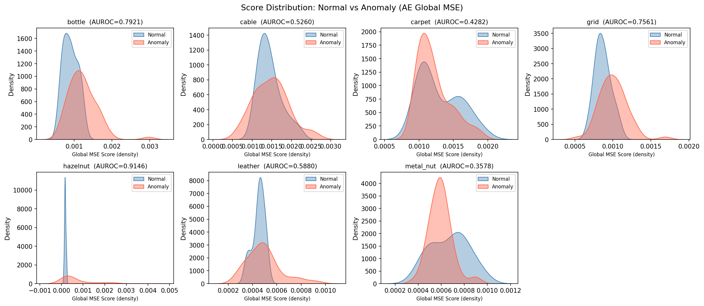
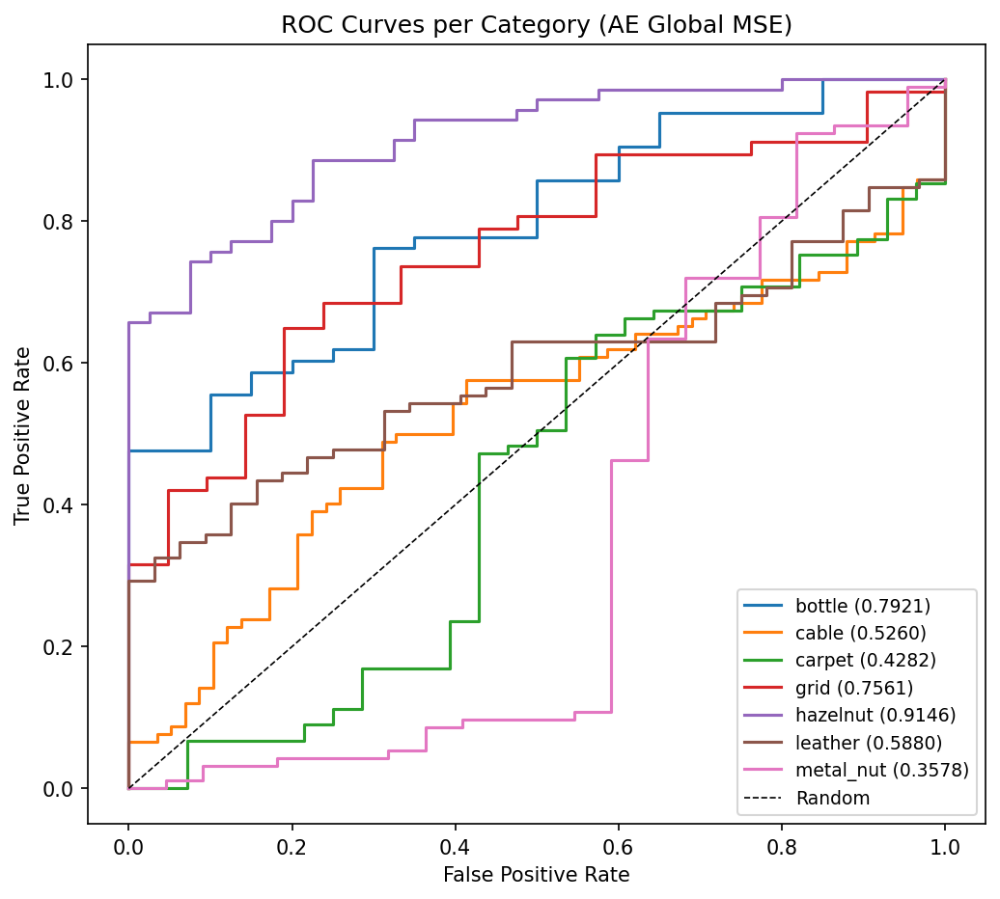
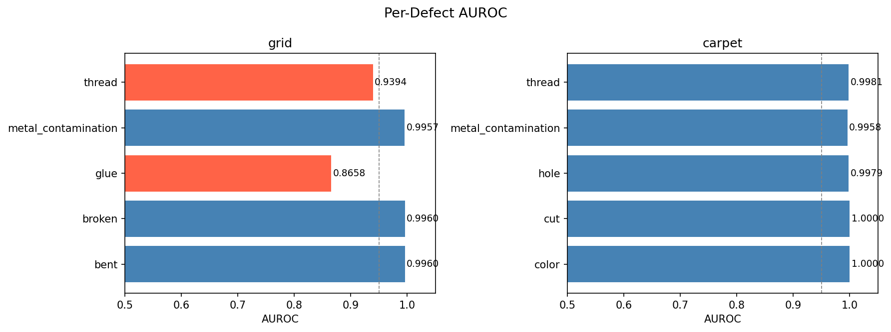

# 유사 이미지 검색 & 이상 탐지기

CLIP / ResNet-50 기반 이미지 유사도 검색과 AutoEncoder / PatchCore 기반 비지도 이상 탐지를 통합한 GUI 애플리케이션입니다.  
MVTec-AD 데이터셋 7개 카테고리를 대상으로 **Global MSE → Patch MSE → PatchCore** 3단계 ablation을 수행하며, 각 접근법의 한계와 개선 근거를 분석했습니다.

<div style="display: flex; gap: 10px;">
    
    
</div>

---

## 목차
1. [프로젝트 개요](#1-프로젝트-개요)
2. [주요 기능](#2-주요-기능)
3. [프로젝트 구조](#3-프로젝트-구조)
4. [설치 및 설정](#4-설치-및-설정)
5. [사용 방법](#5-사용-방법)
6. [설정 옵션](#6-설정-옵션)
7. [이상 탐지 실험 결과](#7-이상-탐지-실험-결과)
8. [결론](#8-결론)
9. [한계 및 향후 과제](#9-한계-및-향후-과제)
10. [문제 해결](#10-문제-해결)

---

## 1. 프로젝트 개요

### 핵심 문제
**비지도 이상 탐지(Unsupervised Anomaly Detection)**는 이상(anomaly) 데이터 없이 정상 이미지만으로 학습한 뒤, 추론 시 정상 분포에서 벗어난 이미지를 탐지해야 합니다.  
이 설정에서 두 가지 대표적인 접근법이 존재하며, 각각 고유한 가정과 한계를 가집니다.

| 접근법 | 핵심 가정 | 구조적 한계 |
|--------|-----------|-------------|
| 재구성 오차 기반 (AE) | 정상은 잘 복원되고, 이상은 복원 오차가 높을 것 | reconstruction에 의존하기 때문에, </br>(1) 이상 패턴까지 일반화하여 복원하는 over-generalization 문제가 발생할 수 있으며, </br>(2) 정상 데이터의 분포가 넓은 경우(예: pose variation) 정상 샘플에서도 높은 reconstruction error가 발생한다. |
| Feature Distance 기반 (PatchCore) | Pretrained feature space에서 정상은 응집되고 이상은 멀리 분포할 것 | (1) backbone feature 품질에 강하게 의존하며, domain shift 발생 시 성능이 저하될 수 있다. </br>(2) patch 단위 비교로 인해 spatial/structural 관계를 충분히 반영하지 못할 수 있다. </br>(3) memory bank가 전체 정상 분포를 완전히 대표하지 못할 경우 오탐이 발생할 수 있다.</br>(4) 메모리뱅크 크기 및 kNN 검색에 따른 추론 비용 증가 문제가 존재한다. |

### 실험 개요
이상 탐지 성능을 단계적으로 개선하는 과정에서 두 가지 핵심을 확인했습니다.

- **Scoring 방식만 바꿔도 성능이 오른다** (Step 1→2): 재학습 없이 Global MSE → Patch MSE 변경만으로 평균 AUROC +0.110 향상
- **재구성 오차 기반 접근의 구조적 한계** (Step 2→3): Scoring 방식 개선으로도 풀리지 않는 카테고리가 존재하며, pretrained feature 기반(PatchCore)으로 전환 시 평균 +0.260 추가 향상

---

## 2. 주요 기능

### 유사도 검색
- Drag & Drop 인터페이스로 쿼리 이미지 입력
- CLIP / ResNet-50 모델 선택 가능
- 사전 계산된 임베딩 DB 기반 빠른 검색
- 상위 k개 유사 이미지 및 유사도 점수 표시

### 이상 탐지
- **비지도 학습** — 정상 이미지만으로 학습, 별도 이상 레이블 불필요
- **두 가지 모델** — GUI RadioButton으로 전환 가능
  - **AutoEncoder**: 재구성 오차(Patch MSE) 기반, 에러 히트맵 시각화
  - **PatchCore**: WideResNet-50 pretrained feature 기반 메모리뱅크
- 카테고리별 threshold 자동 보정 (train/good 분포의 99th percentile)
- `config.py`로 각 모델의 threshold 파일 경로 관리

---

## 3. 프로젝트 구조

```
Image-Similarity-Search/
├── data/
│   └── {category}/
│       ├── train/good/               # 정상 학습 이미지
│       └── test/{defect_type}/       # 테스트 이미지 (MVTec-AD 구조)
├── models/
│   ├── embedder.py                   # CLIP/ResNet 임베딩 추출
│   ├── used_categories.json          # 사용 카테고리 목록 (7개)
│   ├── autoencoder/
│   │   ├── model.py                  # AutoEncoder 아키텍처 (3-layer conv)
│   │   ├── inference.py              # run_anomaly_inference
│   │   ├── anomaly_processor.py      # 카테고리별 전처리 (CLAHE 등)
│   │   ├── __init__.py
│   │   └── weights/
│   │       ├── autoencoder_{category}.pth   # 카테고리별 가중치 (7개)
│   │       ├── thresholds_patch.json        # Patch MSE threshold
│   │       └── thresholds_globalMSE.json    # Global MSE threshold
│   └── patchcore/
│       ├── model.py                  # WideResNet-50 feature extractor
│       ├── inference.py              # run_patchcore_inference
│       ├── __init__.py
│       └── memory_bank/
│           ├── patchcore_{category}.pkl     # 카테고리별 coreset 메모리뱅크 (7개)
│           └── thresholds.json              # KNN 거리 기반 threshold
├── utils/
│   ├── search.py                     # 유사도 검색 함수
│   ├── common.py                     # 공유 유틸리티 (카테고리 목록, 경로 등)
│   ├── train_autoencoder.py          # AE 학습 스크립트
│   ├── ae_calibrate.py               # AE threshold 보정
│   ├── ae_evaluate.py                # AE AUROC 평가 + KDE 시각화
│   ├── pc_calibrate.py               # PatchCore 메모리뱅크 생성 + threshold 보정
│   ├── pc_evaluate.py                # PatchCore AUROC 평가 + KDE 시각화
│   └── visualize_comparison.py       # 두 모델 비교 ROC + 표 생성
├── results/
│   ├── autoencoder/                  # AE 평가 결과 (분포 KDE, ROC, ablation 표)
│   ├── patchcore/                    # PatchCore 평가 결과
│   └── comparison/                   # 두 모델 비교 시각화 (ROC, 비교표)
├── assets/
├── gui_app.py                        # 통합 GUI 앱
├── config.py                         # 경로 및 모델 설정
└── requirements.txt
```

---

## 4. 설치 및 설정

### 필수 요구사항
- Python 3.10
- CUDA 12.1 (GPU 사용 시)

### 패키지 설치

GPU 사용 시:

```bash
pip install torch==2.3.0+cu121 torchvision==0.18.0+cu121 --index-url https://download.pytorch.org/whl/cu121
pip install -r requirements.txt
```

CPU만 사용하는 경우:

```bash
pip install torch torchvision
pip install -r requirements.txt
```

### 데이터 준비

**유사도 검색용:**  
`data/images/` 폴더에 이미지를 넣어주세요. 파일명은 `카테고리명_일련번호.png` 형태여야 합니다. (예: `cable_001.png`, `grid_000.png`)

**이상 탐지용 (MVTec-AD 구조):**

```
data/{category}/train/good/    ← 정상 이미지만
data/{category}/test/good/     ← 정상 테스트
data/{category}/test/{defect}/ ← 이상 테스트
```

---

## 5. 사용 방법

### GUI 앱 실행

```bash
python gui_app.py
```

이상 탐지 탭에서 **AutoEncoder / PatchCore** 중 모델을 선택한 뒤 이미지를 드래그 앤 드롭합니다.

---

### AutoEncoder 준비 (최초 1회)

**1. 모델 학습:**

```bash
python utils/train_autoencoder.py
```

`models/autoencoder/weights/autoencoder_{category}.pth` 에 저장됩니다.

**2. Threshold 보정:**

```bash
python utils/ae_calibrate.py
```

train/good 스코어 분포의 99th percentile을 threshold로 계산합니다.  
→ `models/autoencoder/weights/thresholds_patch.json`

**3. 정량 평가:**

```bash
python utils/ae_evaluate.py
```

→ `results/autoencoder/` (AUROC, KDE 시각화, .npz)

---

### PatchCore 준비 (최초 1회)

**1. 메모리뱅크 생성 + Threshold 보정:**

```bash
python utils/pc_calibrate.py
```

WideResNet-50으로 train/good 이미지 feature를 추출하고 K-Center Greedy coreset(10%)을 구성합니다.  
→ `models/patchcore/memory_bank/patchcore_{category}.pkl`, `thresholds.json`

**2. 정량 평가:**

```bash
python utils/pc_evaluate.py
```

→ `results/patchcore/` (AUROC, KDE 시각화, .npz)

---

### 두 모델 비교 시각화

```bash
python utils/visualize_comparison.py
```

`ae_evaluate.py` 와 `pc_evaluate.py` 의 `.npz` 결과를 재사용합니다 (재추론 없음).  
→ `results/comparison/comparison_table.png`, `results/comparison/comparison_roc.png`

---

## 6. 설정 옵션

### config.py

```python
MODEL_NAME = "clip"         # "clip" 또는 "resnet"  (유사도 검색 모델)
DEVICE     = "cuda"         # torch.cuda.is_available()로 자동 감지

# 이상 탐지 threshold 경로
AE_THRESHOLD_PATH = "models/autoencoder/weights/thresholds_patch.json"
PC_THRESHOLD_PATH = "models/patchcore/memory_bank/thresholds.json"

DEFAULT_TOP_K = 5           # 유사 이미지 검색 기본 개수
```

---

## 7. 이상 탐지 실험 결과

- **데이터셋**: MVTec-AD 7개 카테고리 (bottle, cable, carpet, grid, hazelnut, leather, metal_nut)
- **학습 조건**: 비지도 — 이상 레이블 및 test 이미지 일절 사용하지 않음
- **평가 지표**: Image-level AUROC (1.0 = 완벽, 0.5 = 랜덤)

---

### Step 1 (Baseline) — AutoEncoder + Global MSE

#### 설계

- **아키텍처**: 3-layer conv encoder-decoder
- **입력 해상도**: 128×128
  - 128 / 256 / 512 해상도 예비 실험에서 정상/비정상 간 anomaly score 차이가 128×128에서 가장 명확하게 나타나 채택
- **이상 스코어**: 전체 이미지 픽셀의 평균 재구성 오차 (Global MSE)
- **학습 설정**: Adam (lr=1e-3), MSELoss, batch=16, epochs=50
- **Threshold**: train/good 스코어의 99th percentile (비지도)

#### 결과





| Category   | AE (Global MSE) |
|------------|:--------------:|
| bottle     | 0.7921         |
| cable      | 0.5260         |
| carpet     | 0.4282         |
| grid       | 0.7561         |
| hazelnut   | 0.9146         |
| leather    | 0.5880         |
| metal_nut  | 0.3578         |
| **Mean**   | **0.6232**     |

#### 결과 분석
전체 픽셀 평균 MSE 를 anomaly score로 사용한 결과, 구조가 비교적 단순한 hazelnut, bottle 에서는 준수한 성능을 보였으나, texture 기반 데이터(carpet) 및 pose variation이 큰 데이터(metal_nut)에서는 성능이 크게 저하되었다.</br>
이는 reconstruction 기반 접근이 데이터 분포 양상에 따라 성능 편차가 크다는 점을 보여준다.

#### 한계

결함 영역은 일반적으로 이미지 전체의 1~5%를 차지하며, Global MSE는 이 국소적인 이상 신호를 전체 평균 과정에서 희석시킨다.  
→ **anomaly score가 실제 결함 존재 여부를 충분히 반영하지 못함.**

---

### Step 2 — AutoEncoder + Patch MSE (Scoring 방식 개선)

#### 변경 내용

**모델 재학습 없이** scoring 방식과 threshold 보정만 변경함.

- 128×128 이미지를 16×16 패치 64개로 분할
- 각 패치별 MSE를 계산하여 **최댓값**을 이상 스코어로 사용
  - 최댓값을 쓰는 이유 : 결함이 단 하나의 패치에만 집중되더라도 탐지 가능.  
  패치 평균을 취하면 Step 1과 동일한 희석 문제가 반복됨.

#### 결과


| Category   | AE (Global MSE) | AE (Patch MSE) | Δ (Step 1→2) |
|------------|:--------------:|:--------------:|:------------:|
| bottle     | 0.7921         | 0.8206         | +0.029       |
| cable      | 0.5260         | 0.5697         | +0.044       |
| carpet     | 0.4282         | 0.5116         | +0.083       |
| grid       | 0.7561         | 0.9323         | **+0.176**   |
| hazelnut   | 0.9146         | 0.9439         | +0.029       |
| leather    | 0.5880         | 0.9209         | **+0.333**   |
| metal_nut  | 0.3578         | 0.4321         | +0.074       |
| **Mean**   | **0.6232**     | **0.7330**     | **+0.110**   |

#### 결과 분석
재학습 없이 scoring 방식만 변경했음에도 평균 **+0.110 AUROC** 향상되었다.  
특히 결함이 국소적인 leather(+0.333), grid(+0.176) 데이터에서 개선 폭이 크게 나타났다.

- 결함이 국소적 → 전체 평균에 묻혔던 게 패치로 잡힘 
- 특히 leather는 글로벌 MSE로는 아예 구분 불가였던 것  

이는 anomaly detection에서 “어디서 틀렸는지(localization)”가 score 정의에 직접적으로 반영되어야 함을 보여준다.

#### 한계

cable(0.570)·carpet(0.512)·metal_nut(0.432)는 scoring 방식 변경으로 개선되지 않았다.  

- **cable**: pose variation으로 정상 이미지 자체의 재구성 오차가 높음 → 정상/이상 score 분포가 겹침
- **carpet**: 불규칙 texture를 AE가 blur 형태로 복원 → 결함 영역도 유사하게 복원되어 오차가 낮아짐 (over-generalization)
- **metal_nut**: 심한 회전 variation으로 정상 분포가 넓게 퍼짐 → 정상/이상 score 분포가 겹침

→ 즉, 이는 scoring 방식의 문제가 아니라 **reconstruction 기반 접근법의 구조적 한계**임.  
→ **정상 이미지의 다양성과 이상 이미지의 특이성을 reconstruction error만으로 분리하기 어려우므로, 접근법 전환이 필요함.**

---

### Step 3 — PatchCore (Feature Distance 기반)

#### 접근법 전환 근거

ImageNet pretrained feature space에서 정상 패턴의 feature는 응집(clustered)되어 있고, 이상 패턴의 feature는 자연스럽게 멀리 분포한다. Pretrained feature는 pose나 texture variation에 더 강건하며, 정상 분포를 명시적으로 저장(메모리뱅크)한 뒤 **거리**로 이상 여부를 판단한다.

#### 설계

- **백본**: WideResNet-50 (ImageNet pretrained, 파라미터 전체 동결)
  - Wide channel이 동일 depth의 ResNet-50 대비 더 풍부한 feature 표현을 제공하여 정상/이상 분포 분리에 유리
- **Feature 추출 레이어**: layer2 (512ch, 28×28) + layer3 (1024ch, 14×14) → concat → 1536ch
  - layer2: 국소 texture · structure 이상을 포착하는 세밀한 공간 feature
  - layer3: 구조적 semantic 이상을 포착하는 고수준 feature
  - 두 스케일 결합으로 국소 결함과 구조적 이상을 동시에 감지
- **Locally Aware Pooling**: 3×3 average pooling으로 인접 패치 문맥 통합
- **메모리뱅크**: K-Center Greedy coreset (10%)
  - train/good 전체 feature를 저장하면 추론 시 메모리·속도 비용이 과대함
  - 10% coreset으로 전체 대비 성능을 거의 유지하면서 연산 비용 절감
- **이상 스코어**: KNN (k=1) 최근접 거리
  - "가장 가까운 정상 feature로부터의 거리" = 정상 분포까지의 최솟값을 직접 측정
  - k>1로 평균화하면 분포 경계 케이스에서 이상 신호가 희석될 수 있음

#### 결과


| Category   | AE (Patch MSE) | PatchCore  | Δ (Step 2→3) |
|------------|:--------------:|:----------:|:------------:|
| bottle     | 0.8206         | 1.0000     | +0.179       |
| cable      | 0.5697         | 0.9940     | **+0.424**   |
| carpet     | 0.5116         | 0.9984     | **+0.487**   |
| grid       | 0.9323         | 0.9599     | +0.028       |
| hazelnut   | 0.9439         | 1.0000     | +0.056       |
| leather    | 0.9209         | 1.0000     | +0.079       |
| metal_nut  | 0.4321         | 0.9961     | **+0.564**   |
| **Mean**   | **0.7330**     | **0.9926** | **+0.260**   |

#### 결과 분석
전체 평균 **+0.260 AUROC** 향상되었다. 모든 카테고리에서 AUROC 0.95 이상으로 향상되었으며, 특히 AE에서 낮게 나왔던 cable, carpet, metal_nut에서 성능이 크게 개선되었다. 

이는 pretrained feature space가 texture variation, pose variation, complex pattern 에 대해 더 강건하며, reconstruction이 아닌 **정상 분포와의 거리**가 anomaly 판단 기준으로 더 적합함을 보여준다.

#### 한계
PatchCore 로 바꿈으로써 AUROC가 거의 1에 가까운 우수한 성능을 보였으나, 구조적인 한계 또한 존재한다.
- pretrained backbone feature 품질에 강하게 의존 (domain shift 취약)
- patch 단위 비교로 인해 global structure 이해가 제한적
- memory bank sampling 품질에 따라 정상 분포 coverage 부족 가능성
- kNN 기반 검색으로 메모리 및 추론 비용 증가

---

### 3단계 전체 비교


| Category   | AE (Global MSE) | AE (Patch MSE) | PatchCore  | Δ (Step 1→2) | Δ (Step 2→3) |
|------------|:--------------:|:--------------:|:----------:|:------------:|:------------:|
| bottle     | 0.7921         | 0.8206         | 1.0000     | +0.029       | **+0.179**   |
| cable      | 0.5260         | 0.5697         | 0.9940     | +0.044       | **+0.424**   |
| carpet     | 0.4282         | 0.5116         | 0.9984     | +0.083       | **+0.487**   |
| grid       | 0.7561         | 0.9323         | 0.9599     | **+0.176**   | +0.028       |
| hazelnut   | 0.9146         | 0.9439         | 1.0000     | +0.029       | +0.056       |
| leather    | 0.5880         | 0.9209         | 1.0000     | **+0.333**   | +0.079       |
| metal_nut  | 0.3578         | 0.4321         | 0.9961     | +0.074       | **+0.564**   |
| **Mean**   | **0.6232**     | **0.7330**     | **0.9926** | **+0.110**   | **+0.260**   |


---

### 결과 분석

**Step 1→2 (Global → Patch MSE): +0.110**  
- 재학습 없이 scoring 방식만 바꾸어 유의미한 성능 향상.  
- 국소 결함이 주된 leather(+0.333)·grid(+0.176)에서 개선 폭이 큼.  
- 반면 정상 분포 자체가 넓거나 texture가 복잡한 cable·carpet·metal_nut에서는 효과가 제한적  
→ scoring 방식 외적인 구조적 문제임을 확인.

**Step 2→3 (AE → PatchCore): +0.260**  
- Step 2에서 성능이 낮았던 카테고리에서 개선 폭이 압도적으로 큼 (cable +0.424, carpet +0.487, metal_nut +0.564).  
- Pretrained feature가 pose variation, 복잡한 texture에 강건하다는 가설을 실험적으로 확인. 
- 반면 AE에서 이미 높은 성능을 보였던 hazelnut·grid는 Step 3 개선 폭이 작아, AE가 유리한 조건(균일·단순한 구조, 국소적 결함)이 존재함을 시사.

**PatchCore의 상대적 약점 — grid (0.9599)**  
7개 카테고리 중 유일하게 0.96 미만. 결함 유형별 세부 분석 결과, glue(0.8658)가 전체 AUROC를 끌어내리는 주요 원인으로 확인됨.  
→ 아래 [결함별 세부 분석](#결함별-세부-분석--grid--carpet) 참고

---
### 결함별 세부 분석 — grid · carpet



| Category | Defect Type        | AUROC  | n_samples |
|----------|--------------------|:------:|:---------:|
| grid     | ALL                | 0.9599 | 57        |
| grid     | bent               | 0.9960 | 12        |
| grid     | broken             | 0.9960 | 12        |
| grid     | glue               | 0.8658 | 11        |
| grid     | metal_contamination| 0.9957 | 11        |
| grid     | thread             | 0.9394 | 11        |
| carpet   | ALL                | 0.9984 | 89        |
| carpet   | color              | 1.0000 | 19        |
| carpet   | cut                | 1.0000 | 17        |
| carpet   | hole               | 0.9979 | 17        |
| carpet   | metal_contamination| 0.9958 | 17        |
| carpet   | thread             | 0.9981 | 19        |


- 구조적 변형(bent 0.996, broken 0.996)은 격자 형태 자체를 변화시키기 때문에 feature embedding이 크게 이동하며 안정적으로 탐지됨.

- 반면 glue(0.8658)는 격자 구조를 유지한 채 표면 질감만 미세하게 변화시켜, 정상 패치와의 feature distance가 작게 유지되어 탐지 성능이 저하됨.

- 동일 결함(thread)이 있는 carpet과 grid 비교 시, carpet(0.9981) > grid(0.9394)로 성능의 차이가 나타남.  
  이는 carpet의 경우 결함이 시각적 대비를 크게 유도하여 feature 공간에서 더 큰 변화를 발생시키는 반면,  
  grid에서는 규칙적인 패턴 내에 결함이 부분적으로 포함되어 feature 변화가 상대적으로 제한되기 때문으로 분석됨.

→ 즉, anomaly의 유형보다도 해당 결함이 feature space에서 얼마나 큰 변화를 유도하는지가 탐지 성능을 결정하는 주요 요인이다.

---
## 8. 결론

이번 3단계 ablation은 비지도 이상 탐지에서 성능을 결정하는 요인이 무엇인지를 단계적으로 드러낸다.

**Step 1→2: 어디서 오차를 보는가 (Scoring Granularity)**  
재학습 없이 Global MSE → Patch MSE 변경만으로 평균 +0.110 향상.  
결함은 이미지 전체가 아닌 국소 영역에 존재하므로, anomaly score 정의에 localization이 반영되어야 탐지 가능함을 확인했다.

**Step 2→3: 어떤 feature로 비교하는가 (Feature Representation)**  
Scoring 방식 개선으로도 풀리지 않던 cable·carpet·metal_nut이 PatchCore 전환 후 평균 +0.260 추가 향상.  
Reconstruction error보다 pretrained feature distance가 pose variation·complex texture에 본질적으로 강건함을 실험적으로 확인했다.

**결함별 분석: feature space 변화량이 탐지 가능성을 결정한다**  
grid 내 결함별 AUROC를 보면 구조적 변형(bent·broken 0.996)은 잘 탐지되고, 표면 질감만 바꾸는 glue(0.8658)는 탐지가 어렵다.  
결함 유형 자체보다 **해당 결함이 정상 feature 분포에서 얼마나 벗어나는가**가 탐지 성능을 결정하는 핵심 요인이다.

**판단 기준**

| 조건 | 권장 모델 | 근거 |
|------|-----------|------|
| 균일한 구조, 국소적 결함 (grid·hazelnut류) | AE (Patch MSE) | 정상 분포가 좁아 재구성 기반으로도 분리 가능 |
| Pose variation·복잡한 texture (cable·carpet·metal_nut류) | PatchCore | Reconstruction이 정상 다양성을 커버하지 못함 |
| 표면 질감 미세 변화형 결함 (glue류) | 두 모델 모두 한계 | Feature 변화량 자체가 작아 탐지 난이도 높음 |

---

## 9. 한계 및 향후 과제

### 현재 한계

- **Localization 평가 미수행**: AUROC는 이미지 단위의 정상/이상 분류 성능을 측정. 히트맵은 시각적으로 제공되지만, 결함 위치 정확도를 정량화하는 pixel-level AUROC나 PRO score는 측정하지 않음.
- **제한적 해상도 선택**: 128×128 입력 해상도를 소수 샘플 기반 예비 실험으로 결정. 전체 테스트셋 기준 정량 비교는 미수행.
- **추론 속도 미측정**: AE와 PatchCore 간 inference 속도 비교 없음. PatchCore는 메모리뱅크 크기에 따라 추론 비용이 달라짐.
- **카테고리 범위 제한**: MVTec-AD 15개 카테고리 중 7개만 사용.

### 향후 과제

- Pixel-level Localization 평가 및 히트맵 정량화 (PRO score)
- 전체 15개 카테고리로 확장 실험
- PatchCore 추론 속도 최적화 (FAISS 기반 ANN 탐색)
- 다양한 coreset 비율 실험 (1% / 5% / 10% / 25%)
- WideResNet-50 외 다른 백본 (EfficientNet, ViT 등) 비교 실험

---

## 10. 문제 해결

**`No module named 'models'`**  
`utils/` 하위 스크립트는 반드시 프로젝트 루트에서 실행하세요:

```bash
python utils/ae_evaluate.py     # ✅
cd utils && python ae_evaluate.py  # ❌
```

**AE 모델 파일 없음 오류**  
`models/autoencoder/weights/autoencoder_{category}.pth` 파일이 필요합니다.  
`python utils/train_autoencoder.py` 로 먼저 학습하세요.

**PatchCore 메모리뱅크 없음 오류**  
`python utils/pc_calibrate.py` 를 실행해 메모리뱅크를 생성하세요.  
WideResNet-50 다운로드가 최초 1회 자동으로 수행됩니다 (약 70MB).

**`visualize_comparison.py` 실행 오류**  
`ae_evaluate.py` 와 `pc_evaluate.py` 를 먼저 실행해 `.npz` 파일을 생성해야 합니다.

**메모리 부족**  
GPU 메모리 부족 시 `config.py`에서 `DEVICE = "cpu"` 로 변경하세요.  
PatchCore의 경우 메모리뱅크 생성 단계에서만 대용량 메모리를 사용합니다.
