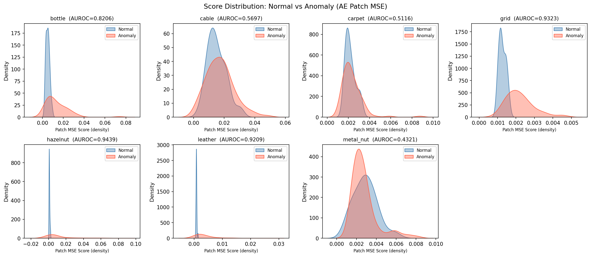
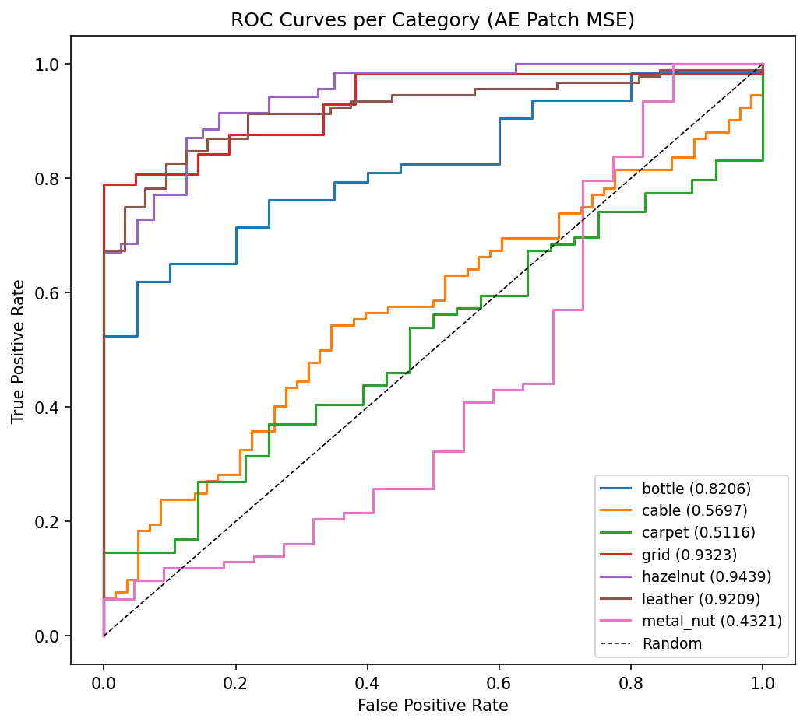
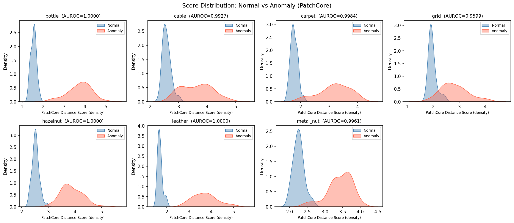
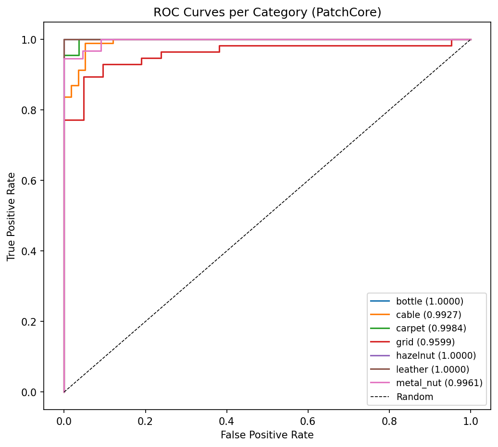
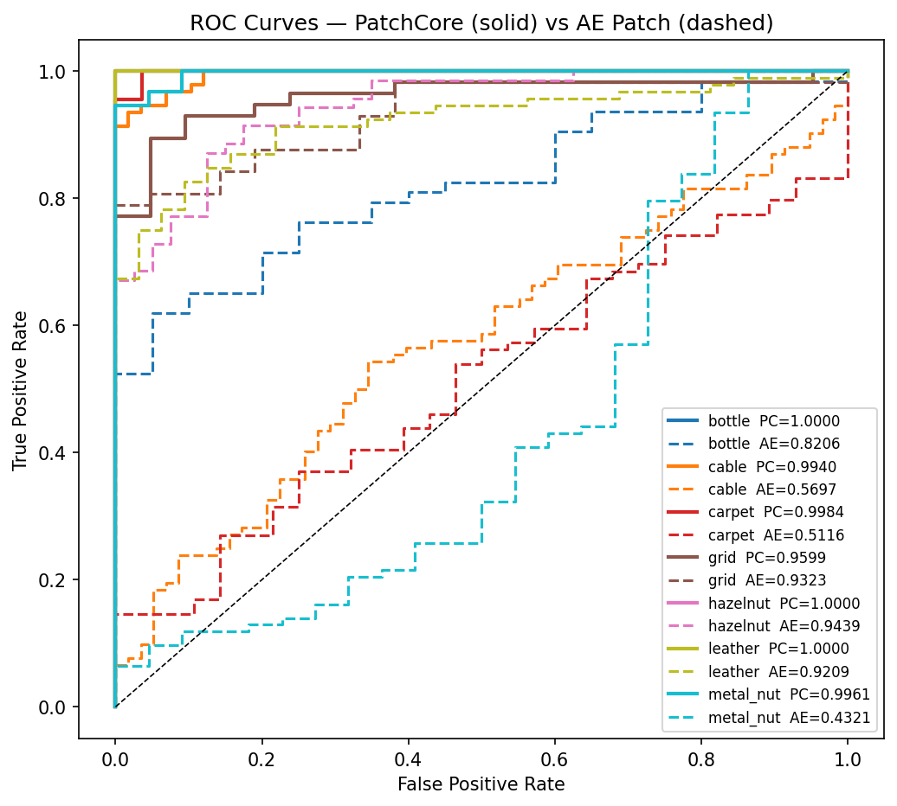

# 유사 이미지 검색 & 이상 탐지기

CLIP / ResNet-50 기반 이미지 유사도 검색과 AutoEncoder / PatchCore 기반 비지도 이상 탐지를 통합한 GUI 애플리케이션입니다.  
MVTec-AD 데이터셋 7개 카테고리를 기준으로 정량 평가 및 3단계 ablation 분석을 수행했습니다.

<div style="display: flex; gap: 10px;">
    
    
</div>

---

## 목차
1. [주요 기능](#1-주요-기능)
2. [프로젝트 구조](#2-프로젝트-구조)
3. [설치 및 설정](#3-설치-및-설정)
4. [사용 방법](#4-사용-방법)
5. [이상 탐지 실험 결과](#5-이상-탐지-실험-결과)
6. [설정 옵션](#6-설정-옵션)
7. [문제 해결](#7-문제-해결)

---

## 1. 주요 기능

### 유사도 검색
- Drag & Drop 인터페이스로 쿼리 이미지 입력
- CLIP / ResNet-50 모델 선택 가능
- 사전 계산된 임베딩 DB 기반 빠른 검색
- 상위 k개 유사 이미지 및 유사도 점수 표시

### 이상 탐지
- **비지도 학습** — 정상 이미지만으로 학습, 별도 이상 레이블 불필요
- **두 가지 모델** GUI RadioButton으로 전환 가능
  - **AutoEncoder**: 재구성 오차(Patch MSE) 기반, 에러 히트맵 시각화
  - **PatchCore**: WideResNet-50 pretrained feature 기반 메모리뱅크, 훨씬 높은 성능
- 카테고리별 threshold 자동 보정 (train/good 분포의 99th percentile)
- `config.py`로 각 모델의 threshold 파일 경로 관리

---

## 2. 프로젝트 구조

```
Image-Similarity-Search/
├── data/
│   └── {category}/
│       ├── train/good/               # 정상 학습 이미지
│       └── test/{defect_type}/       # 테스트 이미지 (MVTec-AD 구조)
├── models/
│   ├── embedder.py                   # CLIP/ResNet 임베딩 추출
│   ├── used_categories.json          # 현 프로젝트에서 사용한 카테고리 목록 (7개)
│   ├── autoencoder/
│   │   ├── model.py                  # AutoEncoder 아키텍처 (3-layer conv)
│   │   ├── inference.py              # run_anomaly_inference
│   │   ├── anomaly_processor.py      # 카테고리별 전처리 (CLAHE 등)
│   │   ├── __init__.py
│   │   └── weights/
│   │       ├── autoencoder_{category}.pth   # 카테고리별 학습 가중치
│   │       ├── thresholds_patch.json        # Patch MSE threshold
│   │       └── thresholds_globalMSE.json    # Global MSE threshold
│   └── patchcore/
│       ├── model.py                  # WideResNet-50 feature extractor
│       ├── inference.py              # run_patchcore_inference
│       ├── __init__.py
│       └── memory_bank/
│           ├── patchcore_{category}.pkl     # 카테고리별 coreset 메모리뱅크
│           └── thresholds.json              # KNN 거리 기반 threshold
├── utils/
│   ├── search.py                     # 유사도 검색 함수
│   ├── common.py                     # 공유 유틸리티 (카테고리 목록, 경로 등)
│   ├── train_autoencoder.py          # AE 학습 스크립트
│   ├── ae_calibrate.py               # AE threshold 보정
│   ├── ae_evaluate.py                # AE AUROC 평가 + KDE 시각화
│   ├── pc_calibrate.py          # PatchCore 메모리뱅크 생성 + threshold 보정
│   ├── pc_evaluate.py           # PatchCore AUROC 평가 + KDE 시각화
│   └── visualize_comparison.py       # 두 모델 비교 ROC + 표 생성
├── results/
│   ├── autoencoder/                  # AE 평가 결과 (분포 KDE, ROC, ablation 표)
│   ├── patchcore/                    # PatchCore 평가 결과
│   └── comparison/                   # 두 모델 비교 시각화 (ROC, 비교표)
├── assets/
├── gui_app.py                        # 통합 GUI 앱
├── config.py                         # 경로 및 모델 설정
└── requirements.txt
```

---

## 3. 설치 및 설정

### 필수 요구사항
- Python 3.10
- CUDA 12.1 (GPU 사용 시)

### 패키지 설치

GPU 사용 시:
```bash
pip install torch==2.3.0+cu121 torchvision==0.18.0+cu121 --index-url https://download.pytorch.org/whl/cu121
pip install -r requirements.txt
```

CPU만 사용하는 경우:
```bash
pip install torch torchvision
pip install -r requirements.txt
```

### 데이터 준비

**유사도 검색용:**  
`data/images/` 폴더에 이미지를 넣어주세요. 파일명은 `카테고리명_일련번호.png` 형태여야 합니다. (예: `cable_001.png`, `grid_000.png`)

**이상 탐지용 (MVTec-AD 구조):**
```
data/{category}/train/good/    ← 정상 이미지만
data/{category}/test/good/     ← 정상 테스트
data/{category}/test/{defect}/ ← 이상 테스트
```

---

## 4. 사용 방법

### GUI 앱 실행
```bash
python gui_app.py
```
이상 탐지 탭에서 **AutoEncoder / PatchCore** 중 모델을 선택한 뒤 이미지를 드래그 앤 드롭합니다.

---

### AutoEncoder 준비 (최초 1회)

**1. 모델 학습** (가중치가 없는 경우):
```bash
python utils/train_autoencoder.py
```
`models/autoencoder/weights/autoencoder_{category}.pth` 에 저장됩니다.

**2. Threshold 보정:**
```bash
python utils/ae_calibrate.py
```
train/good 스코어 분포의 99th percentile을 threshold로 계산합니다.  
→ `models/autoencoder/weights/thresholds_patch.json`

**3. 정량 평가:**
```bash
python utils/ae_evaluate.py
```
→ `results/autoencoder/` (AUROC, KDE 시각화, .npz)

---

### PatchCore 준비 (최초 1회)

**1. 메모리뱅크 생성 + Threshold 보정:**
```bash
python utils/patchcore_calibrate.py
```
WideResNet-50으로 train/good 이미지 feature를 추출하고 K-Center Greedy coreset(10%)을 구성합니다.  
→ `models/patchcore/memory_bank/patchcore_{category}.pkl`, `thresholds.json`

**2. 정량 평가:**
```bash
python utils/patchcore_evaluate.py
```
→ `results/patchcore/` (AUROC, KDE 시각화, .npz)

---

### 두 모델 비교 시각화
```bash
python utils/visualize_comparison.py
```
`ae_evaluate.py` 와 `patchcore_evaluate.py` 의 `.npz` 결과를 재사용합니다 (재추론 없음).  
→ `results/comparison/comparison_table.csv`, `results/comparison/comparison_roc.png`

---

## 5. 이상 탐지 실험 결과

MVTec-AD 데이터셋 7개 카테고리 기준 평가입니다.  
평가 지표: **AUROC** (threshold에 무관한 분리 능력, 1.0 = 완벽, 0.5 = 랜덤)

---

### 접근법 1 — AutoEncoder (재구성 오차 기반)

- **아키텍처**: 3-layer conv encoder-decoder, 128×128 입력
- **이상 스코어**: 16×16 패치 단위 MSE 최댓값
- **Ablation**: 이미지 전체 평균 오차(Global MSE) → 패치 단위 최댓값(Patch MSE)  
  재학습 없이 scoring 방식만 변경해도 평균 +0.110 향상





---

### 접근법 2 — PatchCore (Pretrained Feature 기반)

- **백본**: WideResNet-50 (pretrained) — layer2(512ch) + layer3(1024ch) → 1536ch feature
- **메모리뱅크**: K-Center Greedy coreset (10%), KNN(k=1) 최근접 거리를 이상 스코어로 사용
- AE의 구조적 한계(pose variation, 복잡한 텍스처)를 pretrained feature로 극복





---

### Ablation 비교 (3단계 전체)

AUROC Comparison: AutoEncoder vs. PatchCore
| Category   | AE (Global MSE) | AE (Patch MSE) | PatchCore | Δ (Patch→PC)  |
|------------|:--------------:|:--------------:|:---------:|:-------------:|
| bottle     | 0.7921         | 0.8206         | 1.0000     | **+0.1794**    |
| cable      | 0.5260         | 0.5697         | 0.9940     | **+0.4243**    |
| carpet     | 0.4282         | 0.5116         | 0.9984     | **+0.4868**    |
| grid       | 0.7561         | 0.9323         | 0.9599     | +0.0276        |
| hazelnut   | 0.9146         | 0.9439         | 1.0000     | +0.0561        |
| leather    | 0.5880         | 0.9209         | 1.0000     | +0.0791        |
| metal_nut  | 0.3578         | 0.4321         | 0.9961     | **+0.5640**    |
| **Mean**   | **0.6232**     | **0.7330**     | **0.9926** | **+0.2596**    |



---

### 결과 분석

**AutoEncoder — 성공 케이스** (hazelnut 0.944, leather 0.921, grid 0.932)  
표면 결함처럼 국소적이고 명확한 이상은 패치 단위 오차로 잘 포착됨.

**AutoEncoder — 실패 케이스** (cable 0.570, carpet 0.512, metal_nut 0.432)  
불규칙 텍스처·다양한 pose의 정상 이미지도 재구성 오차가 높아지거나, 반대로 이상 이미지가 잘 복원돼 score가 역전됨. Threshold 조정으로 해결 불가능한 재구성 기반 접근의 구조적 한계.

**PatchCore — 전 카테고리 균일 고성능** (최소 0.994, 평균 ~0.997)  
Pretrained WideResNet feature는 정상 분포를 메모리뱅크로 직접 포착하므로 pose variation이나 복잡한 텍스처에도 강건함.


---

## 6. 설정 옵션

### config.py

```python
MODEL_NAME = "clip"         # "clip" 또는 "resnet"  (유사도 검색 모델)
DEVICE     = "cuda"         # torch.cuda.is_available()로 자동 감지

# 이상 탐지 threshold 경로
AE_THRESHOLD_PATH = "models/autoencoder/weights/thresholds_patch.json"
PC_THRESHOLD_PATH = "models/patchcore/memory_bank/thresholds.json"

DEFAULT_TOP_K = 5           # 유사 이미지 검색 기본 개수
```

---

## 7. 문제 해결

**`No module named 'models'`**  
`utils/` 하위 스크립트는 반드시 프로젝트 루트에서 실행하세요:
```bash
python utils/ae_evaluate.py     # ✅
cd utils && python ae_evaluate.py  # ❌
```

**AE 모델 파일 없음 오류**  
`models/autoencoder/weights/autoencoder_{category}.pth` 파일이 필요합니다.  
`python utils/train_autoencoder.py` 로 먼저 학습하세요.

**PatchCore 메모리뱅크 없음 오류**  
`python utils/patchcore_calibrate.py` 를 실행해 메모리뱅크를 생성하세요.  
WideResNet-50 다운로드가 최초 1회 자동으로 수행됩니다 (약 70MB).

**`visualize_comparison.py` 실행 오류**  
`ae_evaluate.py` 와 `patchcore_evaluate.py` 를 먼저 실행해 `.npz` 파일을 생성해야 합니다.

**메모리 부족**  
GPU 메모리 부족 시 `config.py`에서 `DEVICE = "cpu"` 로 변경하세요.  
PatchCore의 경우 메모리뱅크 생성 단계에서만 대용량 메모리를 사용합니다.
