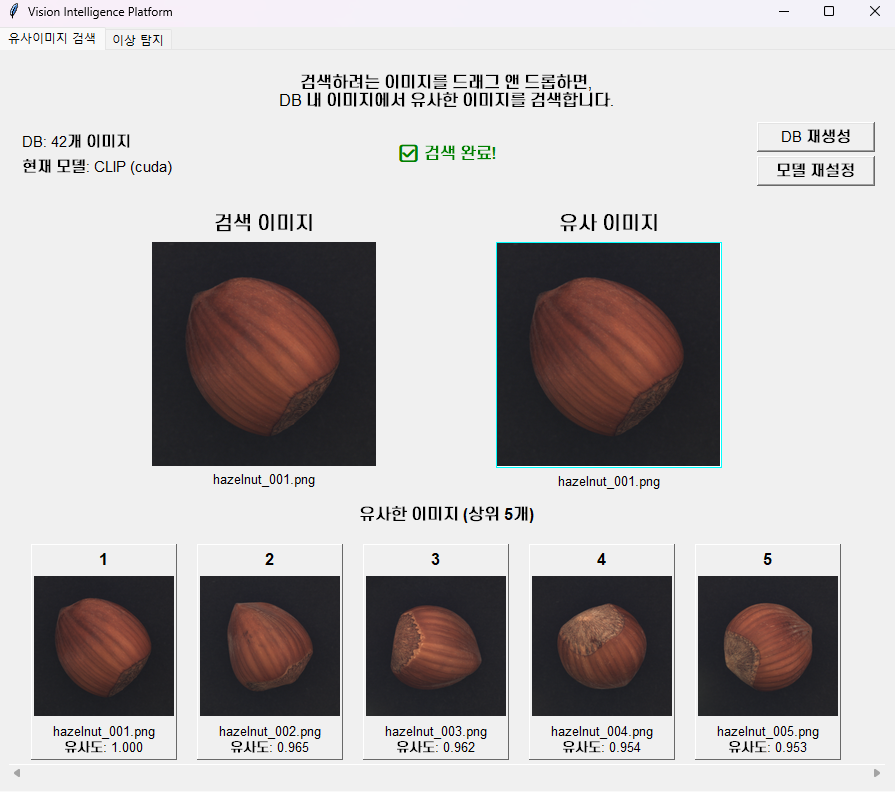
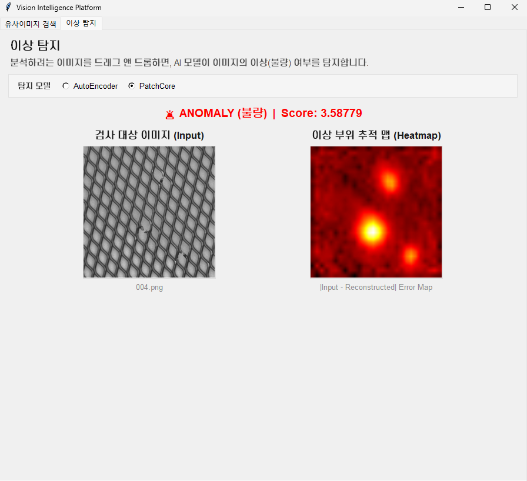
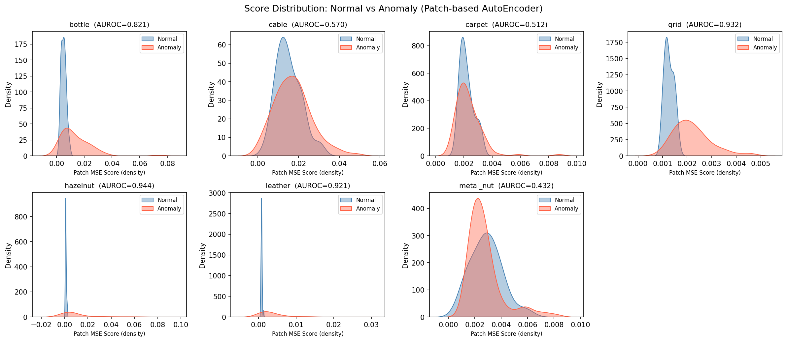

# 유사 이미지 검색 & 이상 탐지기

CLIP / ResNet-50 기반 이미지 유사도 검색과 AutoEncoder 기반 비지도 이상 탐지를 통합한 GUI 애플리케이션입니다.  
MVTec-AD 데이터셋을 기준으로 정량 평가 및 실험 분석을 수행했습니다.

<div style="display: flex; gap: 10px;">
    
    
</div>

---

## 목차
1. [주요 기능](#1-주요-기능)
2. [프로젝트 구조](#2-프로젝트-구조)
3. [설치 및 설정](#3-설치-및-설정)
4. [사용 방법](#4-사용-방법)
5. [이상 탐지 실험 결과](#5-이상-탐지-실험-결과)
6. [설정 옵션](#6-설정-옵션)
7. [문제 해결](#7-문제-해결)

---

## 1. 주요 기능

### 유사도 검색
- Drag & Drop 인터페이스로 쿼리 이미지 입력
- CLIP / ResNet-50 모델 선택 가능
- 사전 계산된 임베딩 DB 기반 빠른 검색
- 상위 k개 유사 이미지 및 유사도 점수 표시

### 이상 탐지
- 비지도 학습 — 정상 이미지만으로 학습, 별도 이상 레이블 불필요
- 패치 기반 MSE 이상 점수 계산 (16×16 패치 단위 최대 오차)
- 에러 히트맵 시각화 (`|입력 - 복원|` 오차맵, hot colormap)
- 카테고리별 threshold 자동 보정 (train/good 분포의 99th percentile)
- `config.json`으로 threshold 파일 경로 관리

---

## 2. 프로젝트 구조

```
Image-Similarity-Search/
├── data/
│   └── {category}/
│       ├── train/good/          # 정상 학습 이미지
│       └── test/{defect_type}/  # 테스트 이미지 (MVTec-AD 구조)
├── models/
│   ├── embedder.py              # CLIP/ResNet 임베딩 추출
│   ├── anomaly_detector_encoder.py   # AutoEncoder 모델 및 추론
│   ├── anomaly_processor.py     # 이미지 전처리
│   ├── autoencoder_{category}.pth    # 학습된 가중치
│   └── thresholds_patch.json    # 카테고리별 threshold
├── utils/
│   ├── search.py                # 유사도 검색 함수
│   ├── calibrate_thresholds.py  # threshold 보정 스크립트
│   ├── evaluate_anomaly.py      # AUROC 정량 평가
│   ├── visualize_results.py     # 분포/ROC/Ablation 시각화
│   └── save_heatmap_samples.py  # 히트맵 샘플 저장
├── results/
│   ├── score_distributions.png
│   ├── roc_curves.png
│   └── ablation_table.png
├── assets/
├── gui_app.py                   # 통합 GUI 앱
├── config.py                    # 유사도 검색 설정
├── config.json                  # 이상 탐지 설정 (threshold 경로 등)
└── requirements.txt
```

---

## 3. 설치 및 설정

### 필수 요구사항
- Python 3.10
- CUDA 12.1 (GPU 사용 시)

### 패키지 설치

GPU 사용 시:
```bash
pip install torch==2.3.0+cu121 torchvision==0.18.0+cu121 --index-url https://download.pytorch.org/whl/cu121
pip install -r requirements.txt
```

CPU만 사용하는 경우:
```bash
pip install torch torchvision
pip install -r requirements.txt
```

### 데이터 준비

**유사도 검색용:**  
`data/images/` 폴더에 이미지를 넣어주세요. 파일명은 `카테고리명_일련번호.png` 형태여야 합니다. (예: cable_001.png, grid_000.png)

**이상 탐지용 (MVTec-AD 구조):**
```
data/{category}/train/good/   ← 정상 이미지만
data/{category}/test/good/    ← 정상 테스트
data/{category}/test/{defect}/← 이상 테스트
```

---

## 4. 사용 방법

### GUI 앱 실행
```bash
python gui_app.py
```

### 이상 탐지 threshold 보정 (최초 1회)
train/good score 분포의 99th percentile을 threshold로 합니다.
```bash
python utils/calibrate_thresholds.py
```
`models/thresholds_patch.json` 에 카테고리별 threshold가 저장됩니다.

### 정량 평가
```bash
python utils/evaluate_anomaly.py   # test 데이터셋으로 정량 평가
python utils/visualize_results.py  # 시각화 PNG 저장 (results/)
```

---

## 5. 이상 탐지 실험 결과

MVTec-AD 데이터셋 7개 카테고리 기준 평가입니다.  
평가 지표: **AUROC** (threshold에 무관한 분리 능력 측정, 1.0 = 완벽, 0.5 = 랜덤)

### Ablation: Global MSE → Patch-based MSE

재학습 없이 inference scoring 방식만 변경 (전체 이미지 평균 → 16×16 패치 단위 최대값).


| Category | Global MSE | Patch-based | Δ |
|----------|:----------:|:-----------:|:---:|
| bottle | 0.7921 | 0.8206 | +0.028 |
| cable | 0.5260 | 0.5697 | +0.044 |
| carpet | 0.4282 | 0.5116 | +0.083 |
| grid | 0.7561 | 0.9323 | **+0.176** |
| hazelnut | 0.9146 | 0.9439 | +0.029 |
| leather | 0.5880 | 0.9209 | **+0.333** |
| metal_nut | 0.3578 | 0.4321 | +0.074 |
| **Mean** | **0.6232** | **0.7330** | **+0.110** |

### Score 분포 시각화 (KDE)



정상/이상 이미지의 Patch MSE Score 분포를 카테고리별로 시각화.  
분포가 잘 분리될수록 높은 AUROC에 대응됨.


### 결과 정리

**성공 케이스** — hazelnut(0.944), leather(0.921), grid(0.932)  
정상 분포가 낮은 score에 밀집되고, 이상 분포가 오른쪽으로 분리됨. 표면 결함처럼 국소적이고 명확한 이상이 패치 단위로 잘 포착됨.

**어느정도 분리** — bottle (0.821)  
정상이 낮은 쪽에 몰리지만 이상 분포 일부가 정상 범위와 겹침.  
contamination처럼 시각적으로 미묘한 결함은 score가 낮게 나와 정상과 구분이 어려움.

**실패 케이스** — cable(0.5697), carpet(0.5116), metal_nut(0.432)  
불규칙 텍스처, 배선 배치의 다양성으로 인해 정상의 score 범위가 넓어 클래스 구분 안됨.  
정상 이미지에 회전/자세 변형이 많아(다양성) 모델이 이상도 잘 복원 → score 역전 현상.  
Threshold 조정으로 해결 불가능한 재구성 기반 접근의 구조적 한계.

**한계 및 다음 단계**  
Pretrained feature 기반 접근(PatchCore)으로 전환하여 pose variation 문제 및 전반적 성능 개선 예정.

---

## 6. 설정 옵션

### config.py 
```python
MODEL_NAME = "clip"       # "clip" 또는 "resnet"
DEVICE     = "cuda"       # 자동 감지
DEFAULT_TOP_K = 5
THRESHOLD_PATH = "models/thresholds_patch.json"
```

---

## 7. 문제 해결

**`No module named 'models'`**  
`utils/` 하위 스크립트는 프로젝트 루트에서 실행하세요:  
```bash
python utils/calibrate_thresholds.py
```

**모델 파일 없음 오류**  
`models/autoencoder_{category}.pth` 파일이 필요합니다. 별도 학습 스크립트로 생성하거나 제공된 가중치를 사용하세요.

**메모리 부족**  
GPU 메모리 부족 시 `config.py`에서 `DEVICE = "cpu"` 로 변경하세요.
